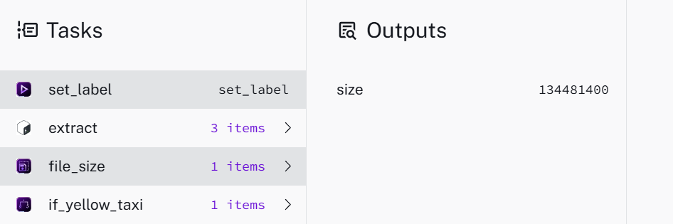
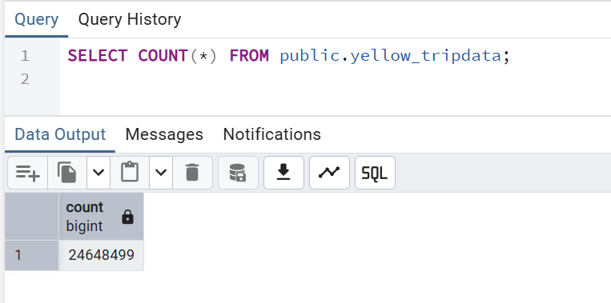
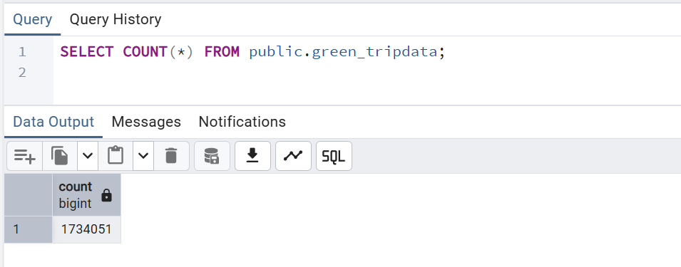
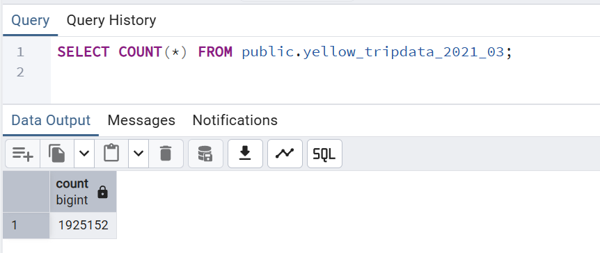

## Module 2 Homework

### Question 1

_Within the execution for `Yellow` Taxi data for the year `2020` and month `12`: what is the uncompressed file size (i.e. the output file `yellow_tripdata_2020-12.csv` of the `extract` task)?_

**128.3 MiB**


Added the following to `hw_postgres_taxi.yaml`:

```
  - id: file_size
    type: "io.kestra.plugin.core.storage.Size"
    uri: "{{outputs.extract.outputFiles[labels.file]}}"
```

Ran the workflow for `Yellow, 2020, 12`. After execution, navigated to **Execution → Outputs → file_size → size**



The file size 134481400 is in bytes.

That's approximately 134.48 MB (or ~128.25 MiB).

### Question 2

_What is the rendered value of the variable `file` when the inputs `taxi` is set to `green`, `year` is set to `2020`, and `month` is set to `04` during execution?_

Name of file in the form:
```
"{{inputs.taxi}}_tripdata_{{inputs.year}}-{{inputs.month}}.csv"
```

Thus, when workflow executed and file name rendered, it should take the form: **`green_tripdata_2020-04.csv`**


### Question 3 & 4

_How many rows are there for the `Yellow` Taxi data for all CSV files in the year 2020?_

**24,648,499**


_How many rows are there for the `Green` Taxi data for all CSV files in the year 2020?_

**1,734,051**


**Step 1: Set Up the Scheduled Flow**

Used `hw_postgres_taxi_scheduled.yaml` 

**Step 2: Execute Backfill**

1. Go to the flow in Kestra UI
2. Click on **Triggers** tab
3. Select the schedule trigger
4. Click **Backfill**
5. Configure:
   - Start date: `2020-01-01`
   - End date: `2020-12-31`
   - Input `taxi`: Select `yellow` or `green`

**Step 3: Wait for All Executions**

The backfill creates one execution per month (12 total for 2020).

**Step 4: Postgres**

Open pgAdmin and run the following to count the rows in both the yellow and green tables.





### Question 5

_How many rows are there for the `Yellow` Taxi data for the March 2021 CSV file?_

**1,925,152**


- 2021 data exists from **January to July** (01-07)
- Data URL: `https://github.com/DataTalksClub/nyc-tlc-data/releases/download/yellow/yellow_tripdata_2021-03.csv.gz`

Modified `hw_postgres_taxi.yaml` to include the following:

```
...
  - id: year
    type: SELECT
    displayName: Select year
    values: ["2019", "2020", "2021"]
    defaults: "2019"

...

variables:
  file: "{{inputs.taxi}}_tripdata_{{inputs.year}}-{{inputs.month}}.csv"
  staging_table: "public.{{inputs.taxi}}_tripdata_staging_{{inputs.year}}_{{inputs.month}}"
  table: "public.{{inputs.taxi}}_tripdata_{{inputs.year}}_{{inputs.month}}"
  data: "{{outputs.extract.outputFiles[inputs.taxi ~ '_tripdata_' ~ inputs.year ~ '-' ~ inputs.month ~ '.csv']}}"

...

```

Executed the workflow for `Yellow, 2021, 03`. Opened pgAdmin and ran the following:



### Question 6

_How would you configure the timezone to New York in a Schedule trigger?_

**Add a `timezone` property set to `America/New_York` in the `Schedule` trigger configuration***


From Kestra docs https://kestra.io/docs/workflow-components/triggers/schedule-trigger#examples

They gave an example:

```
triggers:
  - id: daily
    type: io.kestra.plugin.core.trigger.Schedule
    cron: "@daily"
    timezone: America/New_York

```

