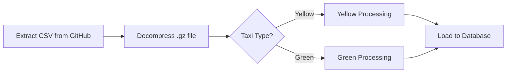

# Module 2 Homework Lab Guide 🚀

This lab guide provides detailed concepts, theory, and step-by-step walkthroughs to help you understand and answer the Module 2 homework questions. **This guide teaches you how to find the answers yourself** rather than providing them directly.

---

## Table of Contents

1. [Prerequisites & Setup](#prerequisites--setup)
2. [Understanding the Data Pipeline](#understanding-the-data-pipeline)
3. [Key Kestra Concepts](#key-kestra-concepts)
4. [Question 1: Understanding File Sizes in Kestra](#question-1-understanding-file-sizes-in-kestra)
5. [Question 2: Understanding Variables and Rendering](#question-2-understanding-variables-and-rendering)
6. [Question 3 & 4: Counting Rows in Taxi Data](#questions-3--4-counting-rows-in-taxi-data)
7. [Question 5: Working with 2021 Data](#question-5-working-with-2021-data)
8. [Question 6: Schedule Trigger Timezone Configuration](#question-6-schedule-trigger-timezone-configuration)
9. [Tips for Success](#tips-for-success)

---

## Prerequisites & Setup

Before working through the homework, ensure you have:

### 1. Kestra Running Locally

```bash
cd 02-workflow-orchestration
docker compose up -d
```

Access the Kestra UI at [http://localhost:8080](http://localhost:8080).

### 2. Required Flows Imported

Import these flows into Kestra (either via UI or API):
- `04_postgres_taxi.yaml` - Manual execution flow for Postgres
- `05_postgres_taxi_scheduled.yaml` - Scheduled flow for Postgres
- `08_gcp_taxi.yaml` - Manual execution flow for GCP
- `09_gcp_taxi_scheduled.yaml` - Scheduled flow for GCP

### 3. Data Source Understanding

The NYC Taxi data comes from: `https://github.com/DataTalksClub/nyc-tlc-data/releases`

Files follow the naming pattern:
- Yellow taxi: `yellow_tripdata_YYYY-MM.csv.gz`
- Green taxi: `green_tripdata_YYYY-MM.csv.gz`

---

## Understanding the Data Pipeline

### ETL vs ELT

The course covers two approaches:

| Approach | Steps | Best For |
|----------|-------|----------|
| **ETL** | Extract → Transform → Load | Local Postgres workflows |
| **ELT** | Extract → Load → Transform | Cloud (GCS → BigQuery) workflows |

### Flow Architecture



---

## Key Kestra Concepts

### 1. Inputs

Inputs are dynamic values passed at runtime. In the taxi flows:

```yaml
inputs:
  - id: taxi
    type: SELECT
    values: [yellow, green]
    defaults: green
    
  - id: year
    type: SELECT
    values: ["2019", "2020"]
    
  - id: month
    type: SELECT
    values: ["01", "02", ... "12"]
```

You access inputs using the syntax: `{{inputs.taxi}}`, `{{inputs.year}}`, `{{inputs.month}}`

### 2. Variables

Variables are reusable expressions defined at the flow level:

```yaml
variables:
  file: "{{inputs.taxi}}_tripdata_{{inputs.year}}-{{inputs.month}}.csv"
```

**Key concept:** Variables define *templates* that get **rendered** with actual values at runtime.

### 3. The `render()` Function

The `render()` function evaluates a variable expression with current context values.

**Example:**
- If `inputs.taxi = "green"`, `inputs.year = "2020"`, `inputs.month = "04"`
- Then `render(vars.file)` produces: `green_tripdata_2020-04.csv`

### 4. Outputs

Tasks can produce outputs that subsequent tasks can reference:

```yaml
# The extract task produces output files
- id: extract
  type: io.kestra.plugin.scripts.shell.Commands
  outputFiles:
    - "*.csv"
    
# Subsequent tasks reference it
data: "{{outputs.extract.outputFiles['green_tripdata_2020-04.csv']}}"
```

### 5. Triggers

Triggers define when a flow runs automatically:

```yaml
triggers:
  - id: schedule
    type: io.kestra.plugin.core.trigger.Schedule
    cron: "0 9 1 * *"  # At 09:00 on day 1 of each month
```

### 6. Backfill

Backfill allows you to run scheduled flows for historical dates. This is essential for processing past data when you add a new scheduled flow.

---

## Question 1: Understanding File Sizes in Kestra

### Concept: Execution Outputs and File Metrics

When Kestra executes a flow, each task produces **outputs** that can include file information such as:
- File name
- File size (in bytes, displayed as human-readable)
- File path

### How to Find File Sizes

**Step 1: Execute the Flow**

1. Navigate to the `04_postgres_taxi` or `08_gcp_taxi` flow
2. Execute with these inputs:
   - Taxi: `yellow`
   - Year: `2020`
   - Month: `12`

**Step 2: Examine the Extract Task Output**

1. Go to **Executions** in the Kestra UI
2. Click on the completed execution
3. Navigate to the **Outputs** tab
4. Find the `extract` task
5. Look for the output file details

**Step 3: Understanding the Output**

The extract task downloads and decompresses the CSV:

```yaml
- id: extract
  type: io.kestra.plugin.scripts.shell.Commands
  outputFiles:
    - "*.csv"
  commands:
    - wget -qO- https://github.com/.../yellow_tripdata_2020-12.csv.gz | gunzip > yellow_tripdata_2020-12.csv
```

The **uncompressed file size** is shown in the outputs panel. Kestra displays file sizes in human-readable format (e.g., MiB, GiB).

### Key Information to Look For

- The `outputFiles` section shows all produced files
- Each file has properties including `size`
- The size is the **uncompressed** CSV size (after `gunzip`)

### 💡 Hint

Navigate through: **Execution → Outputs → extract → outputFiles → [filename] → size**

---


## Question 2: Understanding Variables and Rendering

### Concept: Template Variables vs Rendered Values

This question tests your understanding of how Kestra variables work.

### The Variable Definition

In the flow files, you'll see:

```yaml
variables:
  file: "{{inputs.taxi}}_tripdata_{{inputs.year}}-{{inputs.month}}.csv"
```

### Understanding the Difference

| Aspect | What You See |
|--------|-------------|
| **Variable Template** | `{{inputs.taxi}}_tripdata_{{inputs.year}}-{{inputs.month}}.csv` |
| **Rendered Value** | The actual string after substituting input values |

### How Rendering Works

When inputs are:
- `taxi = "green"`
- `year = "2020"`
- `month = "04"`

The `{{...}}` placeholders are **replaced** with actual values.

### Walkthrough

**Step 1:** Identify the variable pattern
```yaml
file: "{{inputs.taxi}}_tripdata_{{inputs.year}}-{{inputs.month}}.csv"
```

**Step 2:** Substitute each placeholder
- `{{inputs.taxi}}` → `green`
- `{{inputs.year}}` → `2020`
- `{{inputs.month}}` → `04`

**Step 3:** Construct the final string
- Pattern: `[taxi]_tripdata_[year]-[month].csv`
- Result: `?_tripdata_?-?.csv` (fill in the blanks!)

### 💡 Hint

Pay attention to:
- The exact order of components
- The separator characters (underscores and dashes)
- The file extension

---

## Questions 3 & 4: Counting Rows in Taxi Data

### Concept: Aggregating Data Across Multiple Executions

These questions require you to:
1. Process all months of 2020 for a taxi type
2. Count total rows across all CSV files

### Method 1: Use Backfill (Recommended)

**Step 1: Set Up the Scheduled Flow**

Use `05_postgres_taxi_scheduled.yaml` (for Postgres) or `09_gcp_taxi_scheduled.yaml` (for GCP).

**Step 2: Execute Backfill**

1. Go to the flow in Kestra UI
2. Click on **Triggers** tab
3. Select the schedule trigger
4. Click **Backfill**
5. Configure:
   - Start date: `2020-01-01`
   - End date: `2020-12-31`
   - Input `taxi`: Select `yellow` or `green`

**Step 3: Wait for All Executions**

The backfill creates one execution per month (12 total for 2020).

### Method 2: Manual Execution

Execute `04_postgres_taxi.yaml` or `08_gcp_taxi.yaml` manually for each month:
- Run 12 times with inputs: (taxi, 2020, 01), (taxi, 2020, 02), ... (taxi, 2020, 12)

### Counting Rows

#### Option A: Query the Database

After all data is loaded, query the destination table:

**For Postgres:**
```sql
SELECT COUNT(*) 
FROM public.yellow_tripdata 
WHERE filename LIKE '%2020%';
```

**For BigQuery:**
```sql
SELECT COUNT(*) 
FROM `project.dataset.yellow_tripdata` 
WHERE filename LIKE '%2020%';
```

#### Option B: Sum Row Counts from Each Execution

1. Each execution loads data to a monthly table
2. Check the row count in task outputs or logs
3. Sum all 12 monthly counts

### Understanding Row Counts

The `MERGE` operation in the flows inserts data:

```sql
MERGE INTO yellow_tripdata AS T
USING yellow_tripdata_staging AS S
ON T.unique_row_id = S.unique_row_id
WHEN NOT MATCHED THEN INSERT ...
```

This means:
- Duplicate rows (based on `unique_row_id`) are not re-inserted
- Row counts reflect unique trips

### 💡 Hints

- Yellow taxi 2020 has **significantly more** trips than green taxi
- Green taxi 2020 has data for all 12 months but lower volume
- Consider that some months have more trips than others (seasonal patterns)

---

## Question 5: Working with 2021 Data

### Concept: Extending Existing Flows for New Data

The homework asks about 2021 data, which wasn't pre-configured in the flows.

### Understanding the Data Availability

According to the homework:
- 2021 data exists from **January to July** (01-07)
- Data URL: `https://github.com/DataTalksClub/nyc-tlc-data/releases/download/yellow/yellow_tripdata_2021-03.csv.gz`

### How to Process 2021 Data

**Method 1: Manual Execution with Custom Values**

The `08_gcp_taxi.yaml` flow has:
```yaml
- id: year
  type: SELECT
  values: ["2019", "2020"]
  allowCustomValue: true  # This is the key!
```

The `allowCustomValue: true` property lets you type custom values like `2021`.

**Step 1:** Execute `08_gcp_taxi.yaml`
**Step 2:** Select/Enter:
- Taxi: `yellow`
- Year: `2021` (type this manually)
- Month: `03`

**Method 2: Using Backfill**

For `09_gcp_taxi_scheduled.yaml`:
1. Go to Triggers → Schedule → Backfill
2. Set date range: `2021-01-01` to `2021-07-31`
3. Select taxi type: `yellow`

### Finding March 2021 Row Count

After executing for March 2021:

1. Check the execution outputs
2. Query the database for that specific file:

```sql
SELECT COUNT(*) 
FROM yellow_tripdata 
WHERE filename = 'yellow_tripdata_2021-03.csv';
```

### 💡 Hint

March 2021 has a specific number of rows - check the execution outputs or query the loaded data.

---

## Question 6: Schedule Trigger Timezone Configuration

### Concept: Timezone-Aware Scheduling in Kestra

By default, Kestra schedules run in UTC. To configure a specific timezone, you need to understand the Schedule trigger configuration.

### Schedule Trigger Anatomy

```yaml
triggers:
  - id: green_schedule
    type: io.kestra.plugin.core.trigger.Schedule
    cron: "0 9 1 * *"
    inputs:
      taxi: green
```

### Timezone Configuration

Kestra's Schedule trigger supports timezone configuration. The key questions are:
1. **What property name** is used?
2. **What format** for the timezone value?

### Timezone Formats

| Format | Example | Description |
|--------|---------|-------------|
| **IANA/Olson** | `America/New_York` | Standard database identifiers |
| **Abbreviation** | `EST` | Time zone abbreviations (ambiguous!) |
| **UTC Offset** | `UTC-5` | Fixed offset from UTC |

### Best Practices for Timezones

1. **Use IANA timezone names** (e.g., `America/New_York`, `Europe/London`)
   - These handle daylight saving time automatically
   - They are unambiguous

2. **Avoid abbreviations** like `EST`:
   - `EST` is ambiguous (US Eastern? Australian Eastern?)
   - Doesn't handle DST transitions

3. **Avoid fixed offsets** like `UTC-5`:
   - Doesn't account for daylight saving time
   - New York is UTC-5 in winter, UTC-4 in summer

### How to Research This

1. Check Kestra's official documentation on [Schedule triggers](https://kestra.io/docs/concepts/triggers/schedule)
2. Look at the property names and accepted values
3. Consider which format is most reliable for production use

### Example Configuration

```yaml
triggers:
  - id: ny_schedule
    type: io.kestra.plugin.core.trigger.Schedule
    cron: "0 9 * * *"
    # What property and value go here for New York timezone?
```

### 💡 Hints

- The property name is straightforward and describes what it configures
- The value should be a standardized timezone identifier
- Think about what format handles daylight saving time correctly

---

## Tips for Success

### 1. Explore the Kestra UI

- **Executions**: View all past runs, their status, and outputs
- **Outputs Tab**: See what each task produced
- **Logs Tab**: Detailed execution logs
- **Gantt Tab**: Visual timeline of task execution

### 2. Understand the Flow Files

Read through these key flows:
- [04_postgres_taxi.yaml](flows/04_postgres_taxi.yaml)
- [08_gcp_taxi.yaml](flows/08_gcp_taxi.yaml)
- [09_gcp_taxi_scheduled.yaml](flows/09_gcp_taxi_scheduled.yaml)

### 3. Use the Topology View

Kestra's topology view shows how tasks connect and flow - useful for understanding dependencies.

### 4. Check the Course Videos

| Topic | Video Section |
|-------|---------------|
| Kestra Concepts | 2.2.2 |
| Postgres ETL | 2.3.2 |
| Scheduling & Backfills | 2.3.3 |
| GCP Workflow | 2.4.3 |
| GCP Scheduling | 2.4.4 |

### 5. Query Your Data

After loading data, verify with SQL queries:

```sql
-- Check what files were loaded
SELECT DISTINCT filename FROM yellow_tripdata;

-- Count rows per file
SELECT filename, COUNT(*) as row_count 
FROM yellow_tripdata 
GROUP BY filename 
ORDER BY filename;
```

---

## Additional Resources

- [Kestra Documentation](https://kestra.io/docs)
- [Schedule Trigger Docs](https://kestra.io/docs/concepts/triggers/schedule)
- [Variables & Expressions](https://kestra.io/docs/concepts/expression)
- [NYC TLC Data Releases](https://github.com/DataTalksClub/nyc-tlc-data/releases)

---

## Checklist Before Submitting

- [ ] Executed flows for Yellow taxi 2020 (all months)
- [ ] Executed flows for Green taxi 2020 (all months)
- [ ] Executed flow for Yellow taxi March 2021
- [ ] Verified data loaded correctly with SQL queries
- [ ] Understand how variables are rendered
- [ ] Know how to find file sizes in execution outputs
- [ ] Researched timezone configuration in Kestra

Good luck! 🎯
